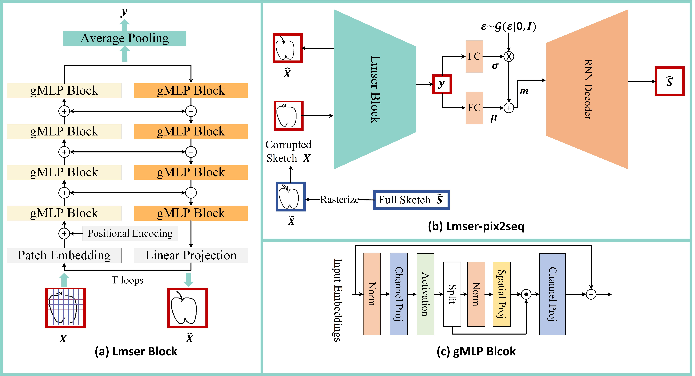

# Lmser-pix2seq: Learning stable sketch representations for sketch healing

This is the official PyTorch implementation of the paper: ["Lmser-pix2seq: Learning Stable Sketch Representations For Sketch Healing"](https://authors.elsevier.com/a/1iTo53qy-3eWnw).

# Overview
> **Abstract:** Sketch healing aims to recreate a complete sketch from the corrupted one. Sketches are abstract and sparse, making it difficult for neural networks to learn high-quality representations of sketches that include colors, textures, and other details. This presents a significant challenge for sketch healing. The features extracted from the corrupted sketch may be inconsistent with the ones from the corresponding full sketch. In this paper, we present Lmser-pix2seq to learn stable sketch representations against the missing information by employing a Least mean square error reconstruction (Lmser) block, which falls into encoder–decoder paradigm. Taking as input a corrupted sketch, the Lmser encoder computes the embeddings of structural patterns of the input, while the decoder reconstructs the complete sketch from the embeddings. We build bi-directional skip connections between the encoder and the decoder in our Lmser block. The feedback connections enable recurrent paths to receive more information about the reconstructed sketch produced by the decoder, which helps the encoder extract stable sketch features. The features captured by the Lmser block are eventually fed into a recurrent neural network decoder to recreate the sketches. We also find that compared with the vanilla convolutional neural networks, our gated multilayer perceptron (gMLP) block based network captures the long-range dependence of different regions in the sketch image, automatically learns the relationship between patches and extracts the individual-specific features from the sketch more effectively. Experimental results show that our Lmser-pix2seq outperforms the state-of-the-art methods in sketch healing, especially when the sketches are heavily masked or corrupted.



# Installation
```
git clone https://github.com/CMACH508/Lmser-pix2seq/
cd Lmser-pix2seq
pip install -r requirements.txt
```

# Preparing Dataset
Download data from the [QuickDraw dataset](https://quickdraw.withgoogle.com/data) for the corresponding categories and storage these data in the './dataset/' fold.

Download random mask seed from [Google drive](https://drive.google.com/file/d/1Q_LTd174AKEOi4zA3ff1Aa3j6qAR7kr8/view?usp=sharing) and move it to the './utils/' fold.

# Training
```
python -u Lmser.py
```

# Hyperparameters
```
class HParams:
    def __init__(self):
        self.data_location = './dataset/'#location of  of origin data
        self.category = ["airplane.npz", "angel.npz", "alarm clock.npz", "apple.npz",
                         "butterfly.npz", "belt.npz", "bus.npz",
                         "cake.npz", "cat.npz", "clock.npz", "eye.npz", "fish.npz",
                         "pig.npz", "sheep.npz", "spider.npz", "The Great Wall of China.npz",
                         "umbrella.npz"]
        self.model_save = "model_save"
        
        self.dec_hidden_size = 512 #Recommended settings are 1024 and above
        self.Nz = 128  # encoder output size
        self.M = 20 
        self.dropout = 0.0
        self.batch_size = 100

        # Unused
        self.eta_min = 0.01
        self.R = 0.99995
        self.KL_min = 0.2
        self.wKL = 0.5
        self.l1weight = 0.0

        self.lr = 0.001
        self.lr_decay = 0.99999
        self.min_lr = 0.00001
        self.grad_clip = 1.
        self.temperature = 0.2
        self.T = 2 # Lmser loops
        self.max_seq_length = 200  
        self.min_seq_length = 0  

        #Unused (only for SketchHealer). 
        self.Nmax = 0  # max stroke number of a sketch
        self.graph_number = 1 + 20  # the number of graph for each sketch,first for global
        self.graph_picture_size = 128  # size of graph 128
        self.out_f_num = 512  # 1000 -> 512
        self.res_number = 2

        self.mask_prob = 0.1 # 0.1 for train. When inference is performed, it is modified in inference.py (Line 395).
        self.use_cuda = torch.cuda.is_available()
        self.l2weight = 0.5

```

Note: 'NAN' problem may occur during training, please retry the training or select a checkpoint to continue training (corresponding to line 392 of 'Lmser.py'). 

# Inference
Pre-trained models based on 512 (default settings in the paper) and 1024 (see './model_save/1024_version/') LSTM cells are provided. 
```
Setting the percentage of masking (corresponding to line 395 of 'inference.py').
python inference.py
```

# Evalutation
```
Setting the results to be evaluated (correponding to line 9 of retrieval.py mask_z_root = './results/[mask prob]/retnpz/'). 
python retrieval.py
```

# Citation
If you find this project useful for academic purposes, please cite it as:
```
@article{li2024lmser,
  title={Lmser-pix2seq: Learning stable sketch representations for sketch healing},
  author={Li, Tengjie and Zang, Sicong and Tu, Shikui and Xu, Lei},
  journal={Computer Vision and Image Understanding},
  pages={103931},
  year={2024},
  publisher={Elsevier}
}
```

# Acknowledgement
[SketchHealer](https://github.com/sgybupt/SketchHealer)

[SP-gra2seq](https://github.com/CMACH508/SP-gra2seq)
